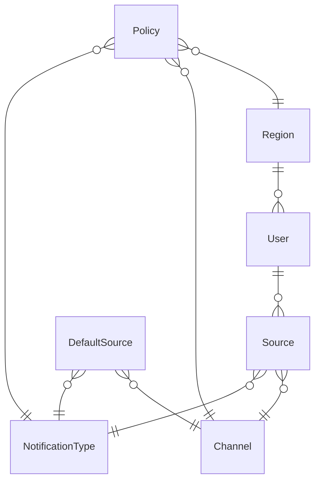

# Notification Preferences Center

Центр управления предпочтениями уведомлений — веб-приложение для настройки каналов и типов уведомлений для пользователей с проверкой глобальных политик и тихих часов.

## Стек технологий

| Компонент           | Технология                              |
|---------------------|-----------------------------------------|
| Фреймворк           | Next.js 16.2.7 (App Router)             |
| Язык                | TypeScript 5                            |
| UI                  | React 19.2.4, Tailwind CSS 4            |
| ORM                 | Sequelize 6.37.8                        |
| База данных (dev/prod) | PostgreSQL 18                        |
| База данных (test)  | SQLite                                  |
| Тестирование        | Jest 30 + Testing Library (DOM, React)  |
| Контейнеризация     | Docker, Docker Compose                  |

## Структура директорий

```
.
├── __tests__/              # Тесты (зеркалируют структуру app/ и services/)
│   ├── app/                #   Интеграционные тесты страниц и API
│   └── services/           #   Модульные тесты сервисов
├── actions/                # Server Actions (обработчики форм и клиентских запросов)
├── app/                    # Next.js App Router (страницы и API)
│   ├── api/                #   API-маршруты
│   └── users/              #   Страницы пользователей
├── config/                 # Конфигурация Sequelize
├── data/                   # Файлы БД (SQLite для тестов, volume для PostgreSQL)
├── helpers/                # Вспомогательные утилиты
├── migrations/             # Миграции Sequelize
├── models/                 # Модели Sequelize
├── public/                 # Статические файлы
├── seeders/                # Сиды Sequelize
├── services/               # Бизнес-логика приложения
├── Dockerfile              # Production-сборка
├── docker-compose.yml      # Оркестрация PostgreSQL + Next.js
├── jest.config.ts          # Конфигурация Jest
└── jest.setup.ts           # Очистка БД после каждого теста
```

## Server Actions (Actions)

### `actions/createNewUser.ts` — createNewUser
Server Action, вызываемый из формы создания пользователя. Принимает `FormData`, преобразует в `UserData`, делегирует создание сервису `services/createUser.ts`, после чего редиректит на страницу созданного пользователя.

### `actions/toggleUserSourceCheckbox.ts` — toggleUserSourceCheckbox
Server Action, вызываемый из клиентского компонента `sourceTable.tsx` при клике на чекбокс. Принимает `userId`, `channelId`, `notificationTypeId`, делегирует переключение источника сервису `services/toggleSource.ts`, возвращает `{ status: "ok" }`.

## Страницы (Pages)

### `/` — Главная
Ссылки на список пользователей и создание пользователя.

### `/users/list` — Список пользователей
Выводит всех пользователей с регионом и часовым поясом. Каждый элемент — ссылка на страницу пользователя.

### `/users/create` — Создание пользователя
Форма с полями: email, регион, начало/конец тихих часов. При отправке вызывает Server Action `createNewUser`, который:
- создаёт пользователя в выбранном регионе;
- создаёт source-записи по умолчанию (из `default_sources`);
- все операции — в одной транзакции.

### `/users/[id]` — Детальная страница пользователя
Отображает email, регион, тихие часы и таблицу `channel × notificationType` с чекбоксами. Чекбокс через клиентский компонент `SourceTable` вызывает Server Action `toggleUserSourceCheckbox`, который включает/отключает источник уведомлений для данной пары.

## API-маршруты (API Routes)

### `POST /api/evaluate`

Проверяет, разрешена ли отправка уведомления.

**Тело запроса:**
```json
{
  "userId": 1,
  "channel": "email",
  "notificationType": "marketing",
  "region": "EU",
  "datetime": "2026-06-08T14:00:00-04:00"
}
```

**Ответ:**
```json
{
  "data": {
    "decision": "allow" | "deny",
    "reason": ""
  },
  "error": null
}
```

Причины отказа: `blocked_by_global_policy`, `blocked_by_quiet_hours`, `blocked_by_channel_and_notification_type`.

### `GET /api/users/[id]/preferences`

Возвращает текущие предпочтения пользователя: дашборд источников и тихие часы.

**Ответ:**
```json
{
  "data": {
    "dashboard": [
      { "channel": "email", "notificationType": "marketing", "active": true },
      ...
    ],
    "quietHours": { "start": "22:00", "end": "08:00" }
  },
  "error": null
}
```

### `POST /api/users/[id]/preferences`

Обновляет предпочтения пользователя.

**Тело запроса (все поля опциональны):**
```json
{
  "startQuietHours": "23:00",
  "endQuietHours": "07:00",
  "channel": "email",
  "notificationType": "marketing",
  "active": true
}
```

Если передан `active: true` — активирует источник (создаёт запись в `sources`). Если `active: false` — деактивирует (удаляет). Тихие часы обновляются при наличии `startQuietHours` или `endQuietHours`.

## Модели и связи

### `Region` — Регион (`regions`)
| Поле     | Тип    | Описание      |
|----------|--------|---------------|
| id       | PK     |               |
| name     | TEXT   | Название (уникальное) |
| timezone | TEXT   | IANA timezone (например `Europe/London`) |

Связи: `Region` → `User` (один ко многим)

### `User` — Пользователь (`users`)
| Поле            | Тип    | Описание              |
|-----------------|--------|-----------------------|
| id              | PK     |                       |
| regionId        | FK     | Ссылка на `Region`    |
| email           | TEXT   | Уникальный            |
| startQuietHours | TIME   | Начало тихих часов    |
| endQuietHours   | TIME   | Конец тихих часов     |

Связи: `User` → `Region` (N:1), `User` → `Source` (1:N)

### `Channel` — Канал (`channels`)
| Поле | Тип  | Описание |
|------|------|----------|
| id   | PK   |          |
| name | TEXT | Уникальный (например `sms`, `email`) |

### `NotificationType` — Тип уведомления (`notification_types`)
| Поле | Тип  | Описание |
|------|------|----------|
| id   | PK   |          |
| name | TEXT | Уникальный (`transactional`, `marketing`) |

### `Source` — Источник уведомления (`sources`)
| Поле              | Тип | Описание                     |
|-------------------|-----|------------------------------|
| id                | PK  |                              |
| userId            | FK  | Ссылка на `User`             |
| channelId         | FK  | Ссылка на `Channel`          |
| notificationTypeId| FK  | Ссылка на `NotificationType` |

Уникальный индекс: `(userId, channelId, notificationTypeId)`.
Определяет, через какой канал и какие уведомления получает конкретный пользователь.

### `DefaultSource` — Источник по умолчанию (`default_sources`)
| Поле              | Тип | Описание                     |
|-------------------|-----|------------------------------|
| channelId         | FK  | Ссылка на `Channel`          |
| notificationTypeId| FK  | Ссылка на `NotificationType` |

Уникальный индекс: `(channelId, notificationTypeId)`.
Определяет, какие источники автоматически создаются при регистрации нового пользователя.

### `Policy` — Глобальная политика (`policies`)
| Поле              | Тип | Описание                     |
|-------------------|-----|------------------------------|
| regionId          | FK  | Ссылка на `Region`           |
| channelId         | FK  | Ссылка на `Channel`          |
| notificationTypeId| FK  | Ссылка на `NotificationType` |

Уникальный индекс: `(regionId, channelId, notificationTypeId)`.
Запрещает определённые комбинации регион-канал-тип. Используется в AllowanceChecker.

### `Trace` — Аудит (`traces`)
| Поле | Тип  | Описание              |
|------|------|-----------------------|
| id   | PK   |                       |
| action | TEXT | Название операции   |
| input  | TEXT | Входные данные (JSON) |
| output | TEXT | Результат (JSON)      |

Логирует все значимые действия: evaluate, createUser, activateSourceForUser, deactivateSourceForUser, updateUserQuietHours.

### Схема связей



## Сервисы (Services)

### `services/allowanceChecker.ts` — **AllowanceChecker**
Класс, реализующий цепочку проверок для решения, можно ли отправить уведомление:
1. **Policy check** — если есть политика, запрещающая комбинацию регион-канал-тип, вернуть `deny`.
2. **Quiet hours check** — для `marketing` уведомлений: если текущий час попадает в тихий час пользователя, вернуть `deny`.
3. **Source check** — если у пользователя нет активного источника для канала+типа, вернуть `deny`.
4. Если все проверки пройдены — `allow`.

Каждый вызов `check()` логируется в `Trace`.

### `services/createUser.ts` — createUser
Создаёт пользователя в транзакции, затем создаёт source-записи для всех `DefaultSource`. Логирует шаги в `Trace`. Вызывается из `actions/createNewUser.ts`.

### `services/toggleSource.ts` — toggleSource
Переключает состояние источника: если запись есть — удаляет, если нет — создаёт. Вызывается из `actions/toggleUserSourceCheckbox.ts`.

### `services/activateSourceForUser.ts` — activateSourceForUser
Создаёт запись `Source` для пользователя (findOrCreate), логирует в `Trace`. Транзакционна.

### `services/deactivateSourceForUser.ts` — deactivateSourceForUser
Удаляет запись `Source` для пользователя, логирует в `Trace`. Транзакционна.

### `services/updateUserQuietHours.ts` — updateUserQuietHours
Обновляет `startQuietHours` и/или `endQuietHours` пользователя, логирует в `Trace`. Транзакционна.

### `services/buildUserSourcesDashboard.ts` — buildUserSourcesDashboard
Строит матрицу `Channel × NotificationType` для пользователя, помечая каждую пару флагом `active`. Не зависит от региона или политик — просто показывает, какие источники включены.

## Вспомогательные утилиты (Helpers)

- **`helpers/successResponse.ts`** — формирует `NextResponse` с `{ data, error: null }` и статусом 200.
- **`helpers/notFoundResponse.ts`** — формирует `NextResponse` с `{ data: null, error }` и статусом 404.
- **`helpers/buildSourceKey.ts`** — склеивает `channelId:notificationTypeId` в строку для Set/Map.
- **`helpers/findHourInUserTimezone.ts`** — определяет час в часовом поясе пользователя по переданному `datetime`.

## Запуск тестов

Тесты используют SQLite (файл `data/test.sqlite`). Перед запуском автоматически выполняются миграции.

```bash
npm run test
```

Команда эквивалентна:
```bash
NODE_ENV=test npx sequelize-cli db:migrate
npx jest
```

После каждого теста база очищается (см. `jest.setup.ts`). Тесты используют `@testing-library/react` для рендера страниц и прямые вызовы API-обработчиков для интеграционных тестов.

## Production-сборка

### Docker

```bash
docker compose up --build
```

Docker Compose поднимает:
- **PostgreSQL 18** — база данных, том монтируется в `./data/postgresql`;
- **Next.js** — production-сборка, порт `3000` на localhost.

При старте выполняются только: `npm run start`. Миграции и сиды запускаются вручную (см. ниже).

## Работа с приложением

После запуска `docker compose up --build` откройте [http://localhost:3000](http://localhost:3000).

При первом запуске выполните миграции и сиды в соседнем терминале:
```bash
docker compose exec next npm run migrate
docker compose exec next npm run seed
```

### Пошаговый сценарий

1. **Главная** — страница содержит две кнопки: «Список пользователей» и «Создать пользователя».

2. **Создание пользователя** — нажмите «Создать пользователя», заполните форму (email, регион, тихие часы) и отправьте. После создания произойдёт редирект на страницу пользователя.

3. **Список пользователей** — нажмите «Назад» (или перейдите на `/users/list`). Убедитесь, что созданный пользователь отображается в таблице.

4. **Детальная страница пользователя** — нажмите на пользователя в списке. Откроется матрица `Channel × NotificationType` с чекбоксами, показывающая, какие источники уведомлений активны.

### API-запросы

#### GET /api/users/[id]/preferences

Получение предпочтений пользователя:

```bash
curl http://localhost:3000/api/users/1/preferences
```

Ответ:
```json
{
  "data": {
    "dashboard": [
      { "channel": "email", "notificationType": "transactional", "active": true },
      { "channel": "email", "notificationType": "marketing", "active": true },
      { "channel": "push", "notificationType": "transactional", "active": true },
      { "channel": "sms", "notificationType": "marketing", "active": false },
      ...
    ],
    "quietHours": { "start": "22:00", "end": "08:00" }
  },
  "error": null
}
```

#### POST /api/users/[id]/preferences — смена тихих часов

```bash
curl -X POST http://localhost:3000/api/users/1/preferences \
  -H "Content-Type: application/json" \
  -d '{"startQuietHours": "23:00", "endQuietHours": "07:00"}'
```

#### POST /api/users/[id]/preferences — включение источника

```bash
curl -X POST http://localhost:3000/api/users/1/preferences \
  -H "Content-Type: application/json" \
  -d '{"channel": "sms", "notificationType": "marketing", "active": true}'
```

#### POST /api/users/[id]/preferences — отключение источника

```bash
curl -X POST http://localhost:3000/api/users/1/preferences \
  -H "Content-Type: application/json" \
  -d '{"channel": "sms", "notificationType": "marketing", "active": false}'
```

#### POST /api/evaluate — проверка разрешения на отправку

Базовый запрос:
```bash
curl -X POST http://localhost:3000/api/evaluate \
  -H "Content-Type: application/json" \
  -d '{"userId": 1, "channel": "email", "notificationType": "marketing", "region": "EU", "datetime": "2026-06-08T14:00:00-04:00"}'
```

Уведомление заблокировано глобальной политикой:
```bash
curl -X POST http://localhost:3000/api/evaluate \
  -H "Content-Type: application/json" \
  -d '{"userId": 1, "channel": "sms", "notificationType": "marketing", "region": "EU", "datetime": "2026-06-08T14:00:00-04:00"}'
```
Ответ: `blocked_by_global_policy` (в EU запрещена комбинация sms+marketing).

Уведомление заблокировано тихими часами:
```bash
curl -X POST http://localhost:3000/api/evaluate \
  -H "Content-Type: application/json" \
  -d '{"userId": 1, "channel": "email", "notificationType": "marketing", "region": "EU", "datetime": "2026-06-08T23:30:00-04:00"}'
```
Ответ: `blocked_by_quiet_hours` (если у пользователя тихие часы с 22:00 до 08:00).

Уведомление заблокировано отсутствием источника:
```bash
curl -X POST http://localhost:3000/api/evaluate \
  -H "Content-Type: application/json" \
  -d '{"userId": 1, "channel": "messenger", "notificationType": "marketing", "region": "EU", "datetime": "2026-06-08T14:00:00-04:00"}'
```
Ответ: `blocked_by_channel_and_notification_type` (источник messenger+marketing не включён у пользователя).

Уведомление разрешено (все проверки пройдены):
```bash
curl -X POST http://localhost:3000/api/evaluate \
  -H "Content-Type: application/json" \
  -d '{"userId": 1, "channel": "email", "notificationType": "transactional", "region": "EU", "datetime": "2026-06-08T14:00:00-04:00"}'
```
Ответ: `allow`.

## Сиды (Seeders)

| Сид                         | Данные                                        |
|-----------------------------|-----------------------------------------------|
| `regions`                   | EU (Europe/London), USA (America/New_York), Russia (Europe/Moscow) |
| `channels`                  | sms, email, messenger, push                   |
| `notification_types`        | transactional, marketing                      |
| `default_sources`           | email+transactional, email+marketing, push+transactional |
| `policies`                  | Запреты: EU/USA sms+marketing, Russia messenger+marketing, Russia messenger+transactional |

## Миграции

```bash
npm run migrate       # Применить все миграции
npm run rollback      # Откатить последнюю миграцию
```

Миграции последовательно создают таблицы в порядке зависимостей: `regions` → `users` → `channels` → `notification_types` → `sources` → `default_sources` → `policies` → `traces`.
